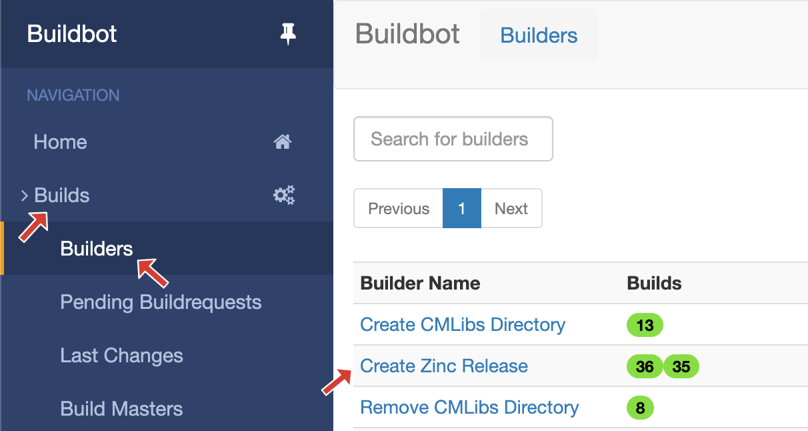
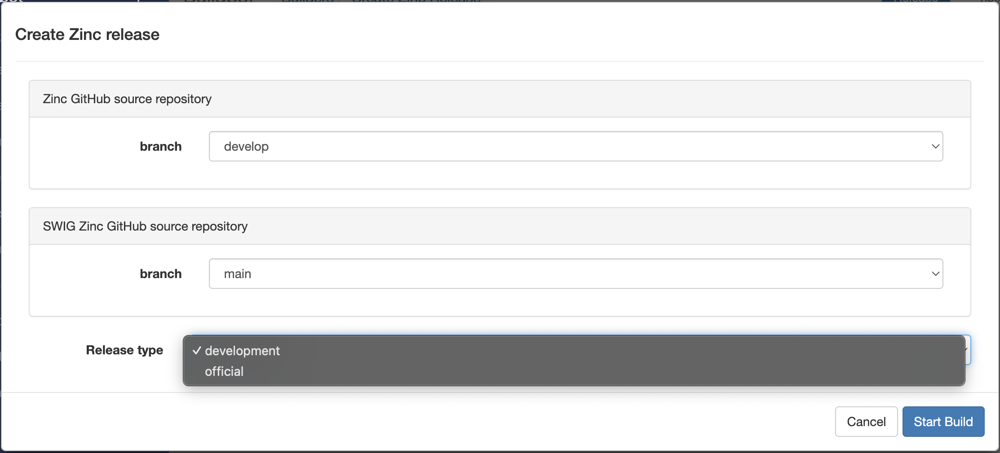

Release Process for Zinc
========================

This document covers the process of making a release for the Zinc library.

Step 1:
-------

Update the CHANGELOG.txt in the root directory of the repository with summary information of changes since the previous release.
Commit the changes and push to the prime repository.

Step 2:
-------

Set the version of the release in the CMakeLists.txt in the root directory.
There are two places to set the version, the version is split into two parts, the official version part and the developer version part.
We also use the developer version to specify release candidate version specifiers.
The official version is set in the *project* command line within the CMakeLists.txt file.
The developer version is set just below the *project* command, this is done by setting the value of Zinc_VERSION_DEVELOPER.

For example, to set the official version to *4.2.0* and the developer version to *-rc.1*::

  project(Zinc VERSION 4.2.0 LANGUAGES C CXX)

  set(Zinc_VERSION_DEVELOPER "-rc.1")

Once the version is set to the desired values, commit and tag the commit with an annotated tag::

  git tag -a v4.2.0-rc.1 -m "Release candidate 1 of version 4.2.0."

Carrying on with the above example.
When creating an official release, that is, not a release candidate, the *Zinc_VERSION_DEVELOPER* will be set empty by the release process.
This does not need to be done manually.

Step 3:
-------

Log in to the Zinc Buildbot available from https://autotest.bioeng.auckland.ac.nz/buildbot/cmlibs.
Navigate to the *Create Zinc Release* builder.

   Navigate to the create Zinc release builder in the Buildbot web interface.

Click on the *Release* button to open the release settings dialog.

   Release button for the create release builder.

The release settings dialogs shows three parameters that can be configured.

1. Branch of the Zinc repository,
2. Branch of the SWIGZinc repository,
3. The release type.

The first two parameters aren't really, options as they have only one possible choice, the *develop* branch for the Zinc repository and the *main* branch for the SWIGZinc repository.
The release type is configurable and the choice is between *official* and *development*.
The *development* release type covers for release candidates as well.
There is not a lot of difference between the two releases, but the *official* release will clear the *Zinc_VERSION_DEVELOPER* variable and pave the way for uploading assets to the various repositories.

   Create release dialog showing both options for release type.

Step 4:
-------

Build the assets and have the assets uploaded to the appropriate repository.
Naviage to the *Upload Zinc Assets* builder.

Click on the *Upload* button to open the upload settings dialog.

The upload assets dialog has three parameters that can be configured.

1. Branch of the Zinc repository,
2. Branch of the SWIGZinc repository,
3. Target worker.

The branch that is chosen for the Zinc and SWIGZinc repositories must match the type of release created.
If the type of release created was an *official* release then the branch for both repositories should be choosen to be *release*.
However, if the type of release created was and *development* release then the branch for the Zinc repository should be chosen to be *develop* (the default).

Cycle through all the available builders starting a build for each.
Do not wait for the builds to finish before starting the next.
The builds can be performed in parallel.

Step 5:
-------

Everything should have completed successfully at this point, this step is to confirm that the appropriate packages are available from their respective repositories.

